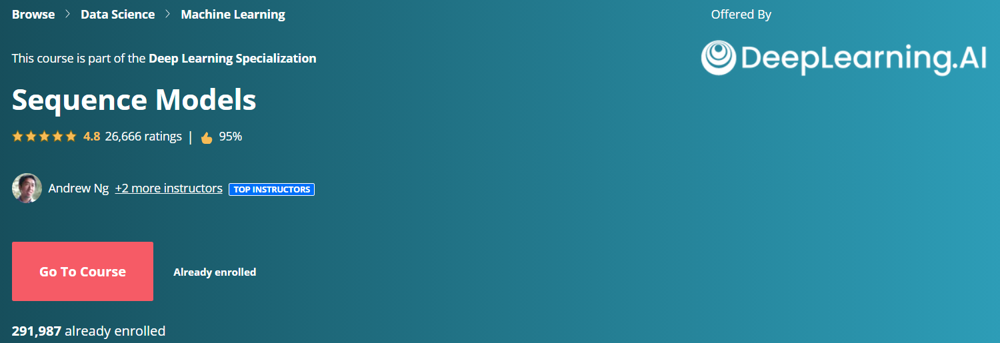

## Deep Learning Specialization 
### Andrew Ng
#### Course 5 out of 5, Coursera

  

In the fifth course of the Deep Learning Specialization, you will become familiar with sequence models and their exciting applications such as speech recognition, music synthesis, chatbots, machine translation, natural language processing (NLP), and more. 

By the end, you will be able to build and train Recurrent Neural Networks (RNNs) and commonly-used variants such as GRUs and LSTMs; apply RNNs to Character-level Language Modeling; gain experience with natural language processing and Word Embeddings; and use HuggingFace tokenizers and transformer models to solve different NLP tasks such as NER and Question Answering.