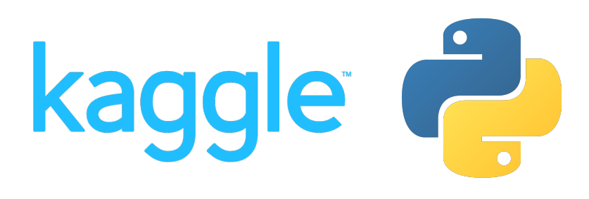

## Python
### Kaggle

  

This course provides a broad introduction to Python Programming Language.

Topics include:

1. **Hello, Python**: A quick introduction to Python syntax, variable assignment, and numbers.

2. **Functions and Getting Help**: Calling functions and defining our own, and using Python's builtin documentation.

3. **Booleans and Conditionals**: Using booleans for branching logic.

4. **Lists**: Lists and the things you can do with them. Includes indexing, slicing and mutating.

5. **Loops and List Comprehensions**: For and while loops, and a much-loved Python feature: list comprehensions.

6. **Strings and Dictionaries**: Working with strings and dictionaries, two fundamental Python data types.

7. **Working with External Libraries**: Imports, operator overloading, and survival tips for venturing into the world of external libraries.

This course covers the key Python skills you’ll need so you can start using Python for data science.
