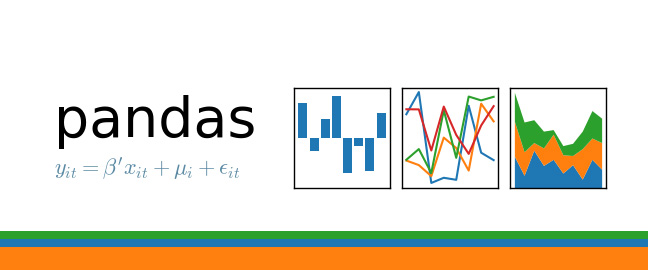

## Python
### Kaggle

  

In this micro-course, you'll learn all about pandas, the most popular Python library for data analysis.

Along the way, you'll complete several hands-on exercises with real-world data. We recommend that you work on the exercises while reading the corresponding tutorials.

Topics include:

1. **Creating, Reading and Writing**: You can't work with data if you can't read it. Get started here.

2. **Indexing, Selecting & Assigning**: Pro data scientists do this dozens of times a day. You can, too!

3. **Summary Functions and Maps**: Extract insights from your data.

4. **Grouping and Sorting**: Scale up your level of insight. The more complex the dataset, the more this matters.

5. **Data Types and Missing Values**: Deal with the most common progress-blocking problems.

6. **Renaming and Combining**: Data comes in from many sources. Help it all make sense together.

